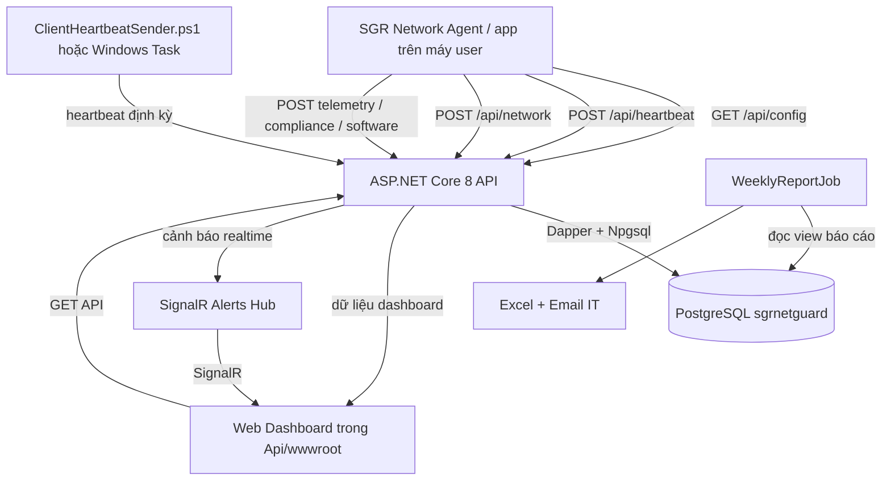

# Kiến trúc SGR NetGuard

Tài liệu này mô tả cách app trên máy người dùng, Web API, Dashboard và database phối hợp với nhau.

## 1. Nhìn nhanh



## 2. Các thành phần chính

### 2.1. App/Agent trên máy người dùng

Mã tích hợp nằm trong `SGRNetGuard.Backend/ClientIntegration/CLIENT_CODE_TO_INSERT.cs`. Đây là các đoạn code để đưa vào app desktop thực tế, không phải một project desktop độc lập.

Agent có các nhiệm vụ chính:

- Lấy cấu hình site, subnet, DNS và người phụ trách từ API qua `GET /api/config`.
- Cache cấu hình tại máy user để app vẫn dùng được khi API tạm thời không truy cập được.
- Nhận diện site/vùng từ địa chỉ IP LAN và subnet.
- Gửi heartbeat định kỳ, thường mỗi 60 giây.
- Gửi CPU, RAM, Disk, thông tin mạng và trạng thái ANBM.
- Gửi cảnh báo hiệu năng khi CPU/RAM/Disk vượt ngưỡng.
- Gửi dữ liệu compliance và software inventory nếu các phần tích hợp đó được bật.

Script hỗ trợ gửi heartbeat hiện có tại `SGRNetGuard.Backend/ClientHeartbeatSender.ps1`. Package cài task Windows nằm trong `ClientHeartbeatPackage/`.

### 2.2. ASP.NET Core Web API

Project API nằm tại `SGRNetGuard.Backend/Api/`.

- Framework: .NET 8 ASP.NET Core.
- Database driver: Npgsql.
- SQL mapping: Dapper.
- Excel: ClosedXML.
- Realtime: ASP.NET Core SignalR.
- Static web: `Api/wwwroot/`.
- Entry point: `Api/Program.cs`.
- Data access: `Api/Data/SqlDataAccess.cs`.
- DTO/model: `Api/Models/`.
- Hub: `Api/Hubs/AlertsHub.cs`.

API vừa phục vụ app desktop, vừa phục vụ web dashboard. Không có backend riêng cho dashboard.

### 2.3. Web Dashboard

Dashboard nằm trong `SGRNetGuard.Backend/Api/wwwroot/`:

- `index.html`: bộ lọc, bảng danh sách máy và khu vực dashboard.
- `dashboard.js`: gọi API, render bảng, biểu đồ, filter, export và kết nối SignalR.
- `style.css`: giao diện bảng và dashboard.
- `device.html` / `device.js`: trang chi tiết một máy.
- `agent.html` / `agent.js`: trang trạng thái agent.

Luồng tải trang:

1. Trình duyệt mở `/`.
2. API kiểm tra đăng nhập dashboard nếu bật bảo vệ.
3. JavaScript gọi `GET /api/devices` để lấy danh sách máy.
4. JavaScript gọi `GET /api/dashboard/summary` để lấy tổng quan.
5. JavaScript kết nối `/hubs/alerts` để nhận cảnh báo realtime.
6. Dashboard tự tải lại dữ liệu định kỳ khoảng 30 giây.

### 2.4. PostgreSQL

Database sử dụng PostgreSQL, database logic là `sgrnetguard`.

Các script chính nằm trong `SGRNetGuard.Backend/Database/`:

- `postgresql_schema.sql`: schema nền.
- `postgresql_seed.sql`: dữ liệu site/subnet ban đầu.
- `03_dashboard_upgrade.sql`: CPU/RAM/Disk và trạng thái ANBM.
- `04_device_detail_upgrade.sql`: dữ liệu chi tiết máy.
- `06_device_identity_upgrade.sql`: Devices, lịch sử, network, performance, compliance, software, alerts.
- `07_last_known_region_upgrade.sql`: vùng gần nhất khi máy ra mạng ngoài.
- `08_network_connection_details_upgrade.sql`: thông tin kết nối mạng.

API tự kiểm tra và bootstrap schema/site catalog khi khởi động thông qua `EnsureDatabaseAndSiteCatalogAsync()`.

## 3. Luồng dữ liệu chính

### 3.1. Cấu hình tập trung

```text
Admin cập nhật Sites / DNS trong PostgreSQL
        |
        v
GET /api/config
        |
        v
Agent tải cấu hình và lưu config.cache.json
        |
        v
NetworkDetectionEngine nhận diện site/vùng/DNS
```

Agent thường tải lại cấu hình lúc khởi động và theo chu kỳ khoảng 6 giờ. Khi API lỗi, agent dùng bản cache gần nhất.

### 3.2. Heartbeat

```text
Agent thu thập thông tin máy
        |
        v
POST /api/heartbeat
        |
        v
SqlDataAccess.UpsertHeartbeatAsync()
        |
        v
DeviceHeartbeats + Devices
        |
        v
GET /api/devices và GET /api/dashboard/summary
        |
        v
Dashboard hiển thị bảng, card và biểu đồ
```

Heartbeat là nguồn chính để dashboard biết máy nào tồn tại, lần cuối online, vùng, site, CPU/RAM/Disk và trạng thái ANBM.

### 3.3. Cảnh báo realtime

```text
Agent phát hiện CPU/RAM/Disk cao
        |
        v
POST /api/telemetry/warning
        |
        +--> PerformanceWarnings trong PostgreSQL
        |
        +--> IHubContext<AlertsHub>
                    |
                    v
             Mọi dashboard đang mở nhận toast SignalR
```

SignalR chỉ đẩy sự kiện realtime. Dữ liệu chính vẫn được lưu database và có thể tải lại qua API.

### 3.4. Báo cáo tuần

`WeeklyReportJob/Program.cs` là console app độc lập:

1. Đọc view `vw_WeeklyPerformanceReport`.
2. Lấy dữ liệu cảnh báo trong 7 ngày gần nhất.
3. Tạo file Excel bằng ClosedXML.
4. Tô đỏ các máy có từ 20 cảnh báo trở lên.
5. Gửi file qua SMTP tới danh sách IT.
6. Có thể chạy bằng Windows Task Scheduler mỗi tuần.

## 4. Các API quan trọng

| API | Mục đích |
|---|---|
| `GET /api/config` | Lấy site, subnet, DNS và cấu hình tập trung |
| `POST /api/heartbeat` | Ghi heartbeat và thông tin hiện tại của máy |
| `POST /api/telemetry/warning` | Ghi cảnh báo hiệu năng và phát SignalR |
| `POST /api/network` | Ghi trạng thái mạng |
| `POST /api/performance/log` | Ghi log hiệu năng |
| `POST /api/compliance` | Ghi trạng thái tuân thủ ANBM |
| `POST /api/software/inventory` | Ghi phần mềm trên máy |
| `GET /api/devices` | Danh sách máy mới nhất |
| `GET /api/dashboard/summary` | Tổng số máy, vùng, compliance và mạng |
| `GET /api/devices/{deviceName}` | Chi tiết một máy |
| `GET /api/devices/{deviceName}/software` | Software inventory của một máy |
| `GET /api/alerts/today` | Cảnh báo trong ngày |
| `GET /api/reports/weekly` | Dữ liệu báo cáo tuần |
| `GET/POST /api/reports/devices/excel` | Xuất Excel danh sách máy |
| `GET /api/health/db` | Kiểm tra kết nối database |
| `/hubs/alerts` | SignalR hub cho cảnh báo realtime |

## 5. Cách deploy hiện tại

### Render/Docker

`Dockerfile` thực hiện:

1. Dùng .NET 8 SDK để restore và publish API.
2. Dùng ASP.NET 8 runtime image để chạy.
3. Copy `wwwroot` vào image.
4. Chạy API trên `0.0.0.0:${PORT}`.

`render.yaml` khai báo service web và các biến môi trường chính:

- `ASPNETCORE_ENVIRONMENT`.
- `DashboardAuth__Enabled`.
- `DashboardAuth__Username`.
- `DashboardAuth__Password`.
- `ConnectionStrings__SGRNetGuard` hoặc `DATABASE_URL`.

### IIS nội bộ

README hiện có cũng hỗ trợ publish API ra IIS bằng `dotnet publish`. Khi chạy IIS:

- Application Pool dùng `No Managed Code`.
- Máy chủ cần ASP.NET Core Hosting Bundle.
- IIS trỏ vào thư mục publish API.
- Dashboard và API dùng chung một origin.

## 6. Biến môi trường và cấu hình

Các cấu hình quan trọng:

- `DATABASE_URL`: URL PostgreSQL kiểu `postgres://...` hoặc connection string tương đương.
- `ConnectionStrings__SGRNetGuard`: connection string PostgreSQL thay thế.
- `DashboardAuth__Enabled`: bật/tắt bảo vệ dashboard.
- `DashboardAuth__Username`: tài khoản dashboard.
- `DashboardAuth__Password`: mật khẩu dashboard, nên truyền qua secret/environment.
- `SGR_NETGUARD_API_URL`: URL API mà desktop agent sẽ gọi.
- Cấu hình SMTP trong `WeeklyReportJob/appsettings.json` để gửi báo cáo.

Không nên ghi password thật vào source control hoặc tài liệu triển khai. Hãy dùng secret của Render, IIS hoặc Windows Credential Manager.

## 7. Khi debug, nên kiểm tra theo thứ tự

1. **Agent có gửi không?** Kiểm tra log agent và thử `POST /api/heartbeat`.
2. **API có nhận không?** Kiểm tra response HTTP và log server.
3. **Database có ghi không?** Kiểm tra bảng `DeviceHeartbeats`, `PerformanceWarnings`, `Devices`.
4. **API có đọc đúng không?** Gọi `GET /api/devices` và `GET /api/dashboard/summary`.
5. **Dashboard có render không?** Mở DevTools, kiểm tra Console/Network và cache JS/CSS.
6. **Realtime có chạy không?** Kiểm tra kết nối `/hubs/alerts` và thử gửi một warning.
7. **Báo cáo có chạy không?** Chạy trực tiếp executable của `WeeklyReportJob` và kiểm tra file Excel/log SMTP.

## 8. Điểm cần lưu ý trong trạng thái hiện tại

- Dashboard, API và SignalR nằm chung trong một service.
- Dữ liệu dashboard phụ thuộc vào heartbeat mới nhất của từng máy.
- Nếu chỉ gửi warning mà không gửi heartbeat định kỳ, danh sách máy có thể thiếu hoặc hiển thị dữ liệu cũ.
- Phân vùng máy thực tế nên được quyết định bởi site/subnet và heartbeat. Các quy tắc gán hiển thị tạm thời trong frontend chỉ phù hợp cho demo hoặc kiểm thử giao diện, không nên dùng làm nguồn dữ liệu vận hành lâu dài.
- API có thể tự bootstrap schema/seed khi khởi động, vì vậy cần bảo đảm connection string đúng trước khi deploy.
